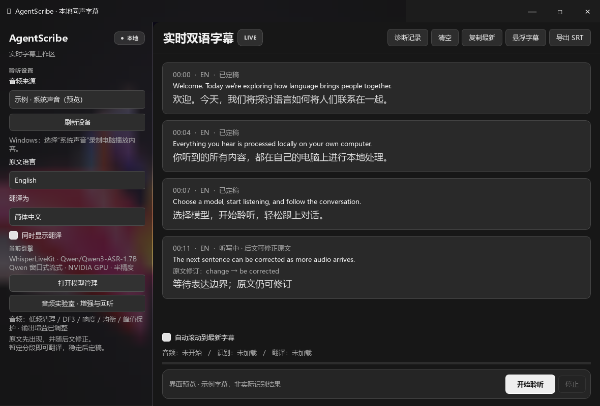
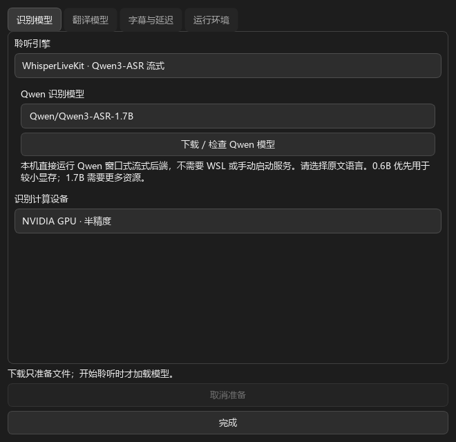

# AgentScribe · Agent 协作开发的本地语音工作台

Windows / macOS 桌面应用：麦克风或系统声音 → 本地原文字幕 → 本地翻译。
v0.4.0 源码预览版，原名 LinguaFlow。使用完整 WhisperLiveKit 音频处理链路，提供 Whisper / AlignAtt 和 Qwen3-ASR 两个本地后端。
Qt 界面与模型运行环境隔离；应用自行启动、停止推理进程，不需要 WSL、端口或手动服务。

本版新增音频实验室、可修订的上下文分句、真实草稿与纠错提示，并修复 Qwen 停顿检测参数未生效的问题。详见 [版本说明](docs/RELEASE_v0.4.0.md) 和 [课堂录音验证](docs/CLASSROOM_VALIDATION.md)。当前提供源码及安装脚本，尚无独立 EXE/DMG 安装包。内部 `linguaflow` 模块名、旧启动命令和本地设置位置保留兼容。

当前版本已完成 WhisperLiveKit / Qwen3-ASR 本地流式链路和桌面回归验收；已通过项目及适用范围见 [验证记录](docs/VALIDATION.md)。



## 安装

需要 Python 3.11–3.13（建议 3.12）、Git、至少 16GB 系统内存。GPU 环境及大模型会占用十余 GB 磁盘，请留足空间。
首次安装与下载需要网络；模型准备后支持严格离线。录音与字幕不上传到云端。

### Windows

```powershell
py -3.12 -m venv .venv
.venv\Scripts\python.exe -m pip install -e ".[dev]"
.venv\Scripts\python.exe scripts\install_runtime.py
.venv\Scripts\python.exe -m linguaflow
```

之后双击 `run-windows.cmd` 启动。`install-gpu-windows.cmd` 安装同一套推理环境。
没有 NVIDIA 显卡时用 `scripts\install_runtime.py --cpu`，并在模型管理中将识别与翻译都设为 CPU。
安装器仅修改项目虚拟环境，Git 长路径选项只对安装子进程生效，不更改系统配置。

### macOS（Apple Silicon）

```bash
python3.12 -m venv .venv
.venv/bin/python -m pip install -e '.[dev]'
.venv/bin/python scripts/install_runtime.py
.venv/bin/python -m linguaflow
```

也可使用 `bash run-macos.command`。当前桌面入口在 Mac 上提供 CPU 推理，尚未启用 Metal/MLX；不要将 Windows CUDA 实测结果视为 Mac 性能保证。未在实体 Mac 上完成验收。
系统设置中需允许 Terminal/Python 使用麦克风。系统声音使用 [BlackHole](https://github.com/ExistentialAudio/BlackHole) 输入与多输出设备；尚无原生 ScreenCaptureKit 捕获。

## 使用

1. 打开“模型管理”，选择 Whisper 或 Qwen、计算设备，下载模型。识别、翻译、聆听行为分别管理。
2. 选择音频来源、原文语言和目标语言。Windows 的“系统声音”选择当前播放设备；Qwen 必须指定原文语言。
3. 点击“开始聆听”。原文先显示，暂定分段即可翻译；原文与译文随后文修订，稳定后再定稿。在“模型管理 → 字幕与延迟”准备 SaT 分句模型、选择 CPU/CUDA 并调整后文观察长度，详见 [语义分段](docs/SEMANTIC_SEGMENTATION.md)。
4. “停止”会处理剩余音频和翻译，然后释放推理进程；关闭窗口会取消剩余任务。
5. 可打开置顶字幕窗口，结束后导出双语 SRT。导出包含已确认字幕。



麦克风环境可先打开侧栏“音频实验室 · 增强与回听”，确认录音来源与输入电平，再用同一段样本比较预设和自定义处理。提供 WebRTC APM、WPE、DF3、响度/EQ/峰值保护；DF3 可选 CPU/CUDA。详见 [音频处理与故障恢复](docs/AUDIO_PROCESSING.md)。

## 模型与显存

- Whisper 使用 WhisperLiveKit 的 AlignAtt 解码器：支持 tiny/base/small/medium/large-v3/turbo、原始 `.pt` 文件或兼容 Hugging Face 目录。**旧 faster-whisper/CTranslate2 目录不能直接用于此解码器。** 在模型管理中重新准备对应格式。
- Qwen 使用 `Qwen/Qwen3-ASR-0.6B` 或 `1.7B` 的窗口式流式适配，限制重编码窗口，运行于本地 PyTorch。没有启用社区英语专用 causal 权重。Qwen 词时间戳是估计值，不适合精密对齐。
- NLLB 支持 600M/1.3B 及兼容目录，可独立选择 CPU 或 CUDA FP16；翻译失败保留原文。
- Whisper 识别与 NLLB 翻译可以独立选择 CPU 或 CUDA；共用 GPU 时请留出两套模型的显存。Qwen 的设备设置由其独立后端处理。
- 8GB 显存优先尝试 Whisper small 或 Qwen 0.6B，加 NLLB 600M。16GB 可使用 large-v3，但总占用受窗口、运行库及其他程序影响，软件没有强制显存配额。
- 模型管理中的更新间隔是调度参数，不表示模型只计算该时长；上游流式后端负责窗口推进。停顿阈值控制话语边界，不是唯一提交依据。

原始 Whisper 下载到 `~/.cache/whisper`；Qwen/NLLB 使用 Hugging Face 缓存，可通过 `HF_HOME` 设置后者位置。翻译下载只选择一种权重格式。
NLLB 权重遵循 [CC-BY-NC-4.0](https://huggingface.co/facebook/nllb-200-distilled-600M)，不默认适用于商业发行。

## 架构和验证

- `.venv`：桌面界面、音频采集、模型下载管理。
- `.venv-wlk`：固定版本 WhisperLiveKit、Qwen 适配、CUDA PyTorch 和翻译。
- `wlk_session.py`：Qt 会话、连续音频临时缓冲、子进程通信。
- `wlk_worker.py`：上游 AudioProcessor/VAC/ASR、字幕映射、异步翻译。
- `wlk_captions.py`：已提交原文与可修订尾部映射，避免提前锁定增长中的上游行。

```powershell
.venv\Scripts\python.exe -m pytest -q
.venv\Scripts\python.exe scripts/smoke_wlk.py --backend qwen3-streaming --translate --repeat 12
.venv\Scripts\python.exe scripts/smoke_session.py --backend qwen3-streaming
.venv\Scripts\python.exe scripts/smoke_session.py --backend wlk-whisper --model large-v3
```

实际运行证据及适用范围见 [VALIDATION](docs/VALIDATION.md)。设计见 [STREAMING_DESIGN](docs/STREAMING_DESIGN.md)，依赖来源见 [THIRD_PARTY_NOTICES](THIRD_PARTY_NOTICES.md)。

音频临时缓冲约 690MB/小时（48 kHz float32），会话结束删除。没有云端 API、语音合成或独立安装包；不声称达到商业软件所有场景的准确率。

项目目录说明见 [PROJECT_STRUCTURE](docs/PROJECT_STRUCTURE.md)。
