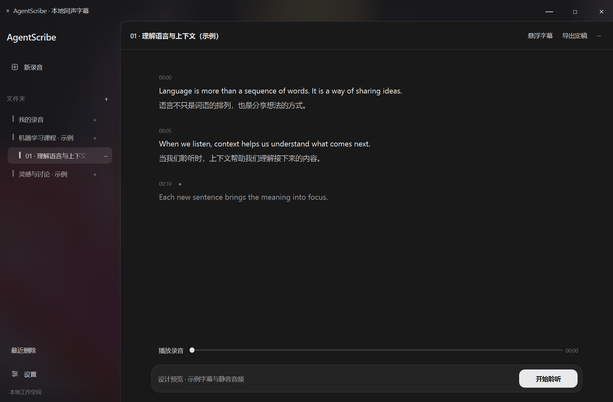
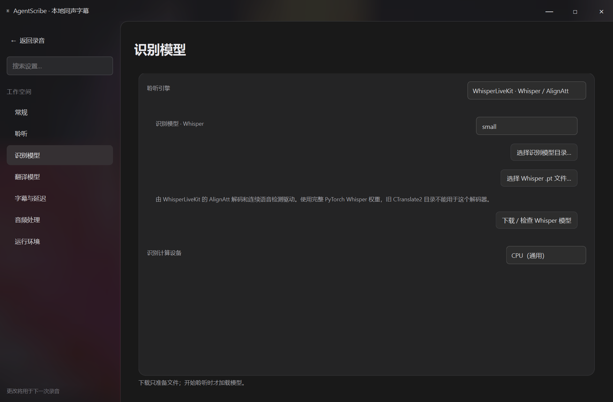

# AgentScribe · Agent 协作开发的本地语音工作台

Windows / macOS 桌面应用：麦克风或系统声音 → 本地原文字幕 → 本地翻译。
v0.5.0 源码预览版，原名 LinguaFlow。使用完整 WhisperLiveKit 音频处理链路，提供 Whisper / AlignAtt 和 Qwen3-ASR 两个本地后端。
Qt 界面与模型运行环境隔离；应用自行启动、停止推理进程，不需要 WSL、端口或手动服务。

窗口显示后会在独立进程后台准备推理运行库，准备阶段不加载模型、不下载文件、不访问音频设备。开始聆听时复用该进程，并按当前设置加载模型；停止后释放模型与会话状态，运行环境闲置 30 分钟后释放，便于课间休息后继续使用，退出软件时彻底关闭。首次准备尚未完成或闲置环境已释放时，开始聆听仍需等待准备。这是 Windows / macOS 共用机制，平台实测范围见 [Mac 验证记录](docs/MACOS_SUPPORT.md)。

本版加入 HY-MT2 前后文翻译、本地文件夹录音工作区，并修复重译失败丢失已有译文、错误标记完成及损坏元数据无法正常处理的问题。详见 [版本说明](docs/RELEASE_v0.5.0.md) 和 [上下文翻译](docs/CONTEXT_TRANSLATION.md)。当前提供源码及安装脚本，尚无独立 EXE/DMG 安装包。内部 `linguaflow` 模块名、旧启动命令和本地设置位置保留兼容。

当前版本已完成 WhisperLiveKit / Qwen3-ASR 本地流式链路和桌面回归验收；已通过项目及适用范围见 [验证记录](docs/VALIDATION.md)。



## 安装

源码版需要 Python 3.11–3.13（建议 3.12）；运行环境安装使用固定提交的源码归档，无需系统 Git。Windows 仅允许 x64、兼容 NVIDIA 显卡：当前 PyTorch 2.11 / CUDA 12.8 需要计算能力 ≥ 7.5（Turing 或更新架构）、驱动 ≥ 570.65。Mac 仅允许原生 Apple Silicon / arm64，拒绝 Intel 和 Rosetta。Windows 建议 16GB 系统内存；Apple Silicon 8GB 的短文件测试范围见下文。GPU 环境及大模型会占用十余 GB 磁盘，请留足空间。
首次安装与下载需要网络；模型准备完整后可在断网时使用。应用不提供严格离线开关，也不在启动推理时强制禁止联网；旧的离线设置不再生效。录音不上传；字幕默认在本地处理。只有明确开启课程云端处理后，才将授权的课件页面图像、文字、定稿和笔记发送给 DeepSeek。

识别和翻译模型统一从设置中显式下载 / 检查，开始聆听只使用本地文件。准备任务可以取消；Whisper 分块校验下载，全部通过后才替换文件，不把整份权重读进内存做摘要。沿用已有 Whisper / Hugging Face 缓存及用户指定的缓存位置。

### Windows

```powershell
py -3.12 -m linguaflow.hardware
py -3.12 -m venv .venv
.venv\Scripts\python.exe -m pip install -e ".[dev]"
.venv\Scripts\python.exe scripts\install_runtime.py
.venv\Scripts\python.exe -m linguaflow
```

之后双击 `run-windows.cmd` 启动。`install-gpu-windows.cmd` 安装同一套推理环境。
没有兼容显卡或驱动不符合要求时，准备脚本在创建环境、下载文件前拒绝安装，不提供 `--cpu` 绕过。已有兼容设备上的 CPU 推理选择仍供诊断使用。
环境准备在独立目录安装依赖、运行 `pip check` 并执行小型 GPU 运算，全部成功后原子切换环境记录；失败或取消保留旧环境，不修改系统 Python。此检查不等于识别模型或实时音频验收。

### macOS（Apple Silicon）

```bash
python3.12 -m linguaflow.hardware
python3.12 -m venv .venv
.venv/bin/python -m pip install -e '.[dev]'
.venv/bin/python scripts/install_runtime.py
.venv/bin/python -m linguaflow
```

也可使用 `bash run-macos.command`。Whisper CPU 已通过文件识别测试；新增 Qwen3-ASR 1.7B / MLX 4-bit **试验入口**，已在 M2 / 8GB 上完成英文短音频和 101 秒连续音频的 GPU 字幕测试。中文、长会话和真实录音仍待验收。

试用 Apple GPU 路线，另行执行 `.venv/bin/python scripts/install_mlx.py`（或模型管理 → 运行环境 → 安装 Apple GPU）。然后选择“试用 Mac 4-bit 设置”，下载 / 检查 Qwen 模型，并指定原文语言。此配置关闭翻译；下载 / 检查识别模型会一并准备必要的字幕分句组件，可按需要再开启翻译。MLX 使用独立环境（兼容原有 `.venv-mlx`），避免与 Windows / WLK 的 Transformers 版本冲突。

Windows / PyTorch 与 macOS / MLX 的 Qwen 共用一套识别确认和修订逻辑：短停顿保留音频，默认使用 30 秒窗口与重叠尾部；至少多轮识别一致后确认前文，窗口满了不确认整段。SaT 可以暂定切分，只有对应 ASR 文字已确认才能收尾；两者均确认后翻译才定稿。句尾先保留初译，等待后文或停止时收尾。详见 [语义分段](docs/SEMANTIC_SEGMENTATION.md)。

M2 / 8GB 的 101 秒文件测试已跑通 GPU 识别与 SaT 分句：首条字幕约 2.26 秒、收尾约 3.04 秒，25 段字幕全部定稿，WER 0.39%。测试关闭翻译，没有访问音频设备；系统交换空间增长约 1.46 GiB，仍需验证长会话。详见 [测试记录](docs/MACOS_FILE_TESTS.md)。
Apple Silicon 的翻译可选择“设置 → 翻译模型 → 使用 HY 1.8B · Apple GPU”，推理引擎显示“llama.cpp · GGUF”，计算设备显示“Apple GPU · Metal”。首次点击“下载 / 检查翻译模型”，或运行 `.venv/bin/python scripts/install_llama.py --device metal`，准备官方量化权重和本地运行组件。开启翻译后，下次聆听自动加载；诊断会显示实际 GPU 加载层数。已打开的应用需在录音结束后重新启动，才能载入更新的代码。长会话和内存压力下的稳定性仍待验收，详见 [HY Metal 测试](docs/testing/HY_METAL.md)。
系统设置中需允许 Terminal/Python 使用麦克风。系统声音使用 [BlackHole](https://github.com/ExistentialAudio/BlackHole) 输入与多输出设备；尚无原生 ScreenCaptureKit 捕获。

Mac 适配进展、已验证范围和待实机测试项目见 [macOS 适配记录](docs/MACOS_SUPPORT.md)。如果电脑正在进行其他录音，开发验证请使用 `.venv/bin/python scripts/test_no_audio.py`；该入口使用模拟音频，并阻止原生音频后端导入，不启动实际应用或录音测试。

## 使用

录音按真实文件夹保存，提供命名、删除恢复、自动保存与回听。新用户默认使用独立用户目录：Windows `%LOCALAPPDATA%\AgentScribe\录音`，Mac `~/Library/Application Support/AgentScribe/录音`，可在设置中更改。已有保存位置和项目内旧录音继续使用，不自动搬移或删除。详见 [工作区说明](docs/WORKSPACE.md)。

设置 → 运行环境 → 检查软件更新，仅在点击时连接 GitHub。源码版提示已发布的源码版本；后续安装版按 Windows x64 / macOS arm64 和当前稳定或 beta 渠道匹配具体产物，不能用另一平台的最新版本代替。当前尚无安装包，不提供自动替换程序或卸载器；新默认数据目录独立于程序，旧项目内录音在清理项目之前仍须备份。

首页底部的语言与识别引擎按钮可直接打开对应设置。侧栏“使用指南”介绍首次准备、字幕修订和录音整理；设置支持搜索字幕、GPU、HY-MT2 等关键词。`Ctrl+,` 打开设置，`Ctrl+F` 聚焦设置搜索，`Ctrl+N` 新建录音，`Esc` 从设置返回录音。在“常规 → 减少动态效果”中可关闭切页、弹窗和开关动画。界面变更与验证范围见 [界面体验说明](docs/UI_EXPERIENCE.md)。

1. 打开左下角“设置 → 识别模型”，选择 Whisper 或 Qwen、计算设备，下载模型。识别、翻译、聆听行为分别管理。
2. 在首页底部直接选择音频来源，在语言快捷入口选择原文与目标语言；在左侧文件夹行点击“＋”，填写录音名称并确认保存位置。Windows 的“系统声音”选择当前播放设备；Qwen 必须指定原文语言。字幕位于底部时自动平滑跟随；向上滚动暂停，点击圆形向下箭头或自行回到底部即可恢复。
3. 下载 / 检查识别模型会一起准备字幕分句组件；分句固定使用 CPU，无需独立选择设备或调参。准备完成后点击“开始聆听”。首次提交与已提交原文的变化立即进入小上下文初译队列；ASR 文字与 SaT 边界均确认后，再生成当前版本的大上下文最终译文。分句组件加载失败会提示重新检查识别模型，推理异常会停止会话并提示原因，详见 [语义分段](docs/SEMANTIC_SEGMENTATION.md)。
4. 聆听时点击“暂停”会释放当前采集句柄，继续处理已有音频和翻译；点击“继续录音”接着写入同一份录音，暂停期间的声音和等待时间不计入录音及字幕时间轴。暂停时也可直接停止。“停止”会处理剩余音频和翻译，然后释放会话模型；保留已准备的运行库以加快下一次聆听，空闲 30 分钟或退出应用时关闭进程。关闭窗口也会先停止采集并处理剩余任务，随后保存会话。加载期间仍可取消启动。暂停功能已用模拟采集及文件回放验证，真实设备验收范围见 [暂停测试记录](docs/testing/RECORDING_PAUSE.md)。
5. 录音和定稿自动保存在本机，点击侧栏会话可回听。可打开置顶字幕窗口，结束后导出双语 SRT。导出包含已确认字幕。



选择音频来源后直接开始聆听，后台自动完成轻微增益、峰值保护和模型所需的重采样，无需调整音频参数。原始录音照常保存；不默认启用强降噪或去混响。详见 [后台音频处理与实测依据](docs/AUDIO_PROCESSING.md)。

应用打开后在后台准备共享运行库，缩短开始聆听时的导入等待；不会提前加载识别权重、访问音频设备或修改联网行为。桌面与文件识别使用同一启动流程，保留已准备进程。开始聆听时，PyTorch / MLX / Whisper 复用同一识别与分句加载协调，全部就绪后才创建音频处理链；失败和取消统一回收自有资源。SaT 与语音活动检测固定使用 CPU ONNX，兼容运行环境复用准备好的 SaT 内存映射缓存；识别与翻译仍按用户选择使用 CPU / CUDA / Apple GPU。Windows 课堂片段对照、双语流程与缓存成本见 [最新验证记录](docs/VALIDATION.md#2026-10-06-统一识别与-sat-启动)，预热内存代价见该文历史记录；本轮 Mac 实机仍待复核。

## 课程资料与笔记（Beta）

在“设置 → 常规”开启“体验 Beta 功能”，才会显示课程入口。默认关闭，已有用户也不会自动开启；关闭后隐藏入口、停止课程后台，下一次录音不再应用课程术语。已有课件、审核结果和笔记保留。Beta 开关与课件/笔记上传许可分别控制，开启体验不会自动授予上传许可。

选择或新建录音后，点击顶部“课程资料与笔记 · Beta” → “导入课件”。可导入 PDF、PPT/PPTX/ODP、DOC/DOCX/ODT、XLS/XLSX/ODS、HTML/HTM、Markdown、TXT、CSV/TSV，以及 PNG/JPEG/WebP/GIF/BMP/ICO/SVG。Office 保留静态页；表格按全部可见工作表的数据区域分片；网页保留本地图片、样式、SVG 和脚本绘制的 Canvas，横向和纵向溢出均分片保存。网页所需资源必须随文件在本地提供，缺少资源时明确失败。图片按静态图读取，多帧位图仅首帧。

允许课程云端处理后点击“完整阅读并提取术语”：全部页面图像逐页发送模型，包含无文字图形页和空白页；原生文字只作辅助。新增格式导入后即可在本地预览原页，无需密钥或上传。界面分别显示原页、模型视觉解读和已读页数，解读与原生文本分别保存和引用。已读完不表示模型理解无误；可手工录入和审核术语。

可选云端功能需要在桌面环境安装额外依赖：Windows 运行 `.venv\Scripts\python.exe -m pip install -e ".[knowledge]"`；Mac 使用 `.venv/bin/python -m pip install -e '.[knowledge]'`。PDF/Office 页面渲染还需 Node.js 22.19 或更新版本，然后运行 `.venv\Scripts\python.exe scripts/install_documents.py`（Mac 使用 `.venv/bin/python`）。安装器在项目 `.runtime/components/document-renderer` 的独立目录准备 DSH LibreOffice Kit 0.1.3，验证成功后切换；兼容旧 `.runtime/document-renderer`。历史 Windows x64 安装约 197 MiB。网页、文本和图片复用既有 PySide6，不新增浏览器或 OCR 依赖；网页截图在自有子进程中使用 CPU，并禁用真实音频输入/输出。macOS arm64 已通过生成夹具的本地格式导入回归；网页转换需要当前进程能访问 macOS 图形会话，受限环境会提示原因并保留原件。详见 [Mac 更新复核](docs/MACOS_SUPPORT.md#2026-10-09windows-更新的本机适配)。安装不改变识别设备。

勾选术语并保存审核结果后，下一次 Qwen 录音会固定课程上下文；PyTorch 使用 `context`，MLX 使用 `system_prompt`。Whisper 保持原有行为。当前是参数接入与模拟验证，尚未证明术语改善识别质量，也没有完成本轮 Mac GPU 实测。

“配置 DeepSeek 密钥”使用系统凭据存储，不将密钥写入课程文件。课件图像与文字按课程开启；旧的仅文字许可不会自动授权上传图片。笔记与问答按录音另行开启，导入课件时须先完成全部页读取。开启后，成功保存的定稿原文分批生成带引用笔记，课后可按章节整理或提问，并按需重读相关原页。字幕变化会使相关笔记待核对或失效；个人编辑不会被模型覆盖。引用可定位课件页或录音位置，点击引用不自动播放。详见 [工作区说明](docs/WORKSPACE.md#课程资料与笔记) 和 [设计与实施状态](docs/AgentScribe_软件开发设计文档.md#132-当前实施状态2026-10-09)。

目前通过 Windows 与 macOS 本地格式、课程后台和模拟服务回归；真实 DeepSeek、系统凭据写入、用户课件质量及术语对两端实际识别质量的影响仍待验收。云端默认关闭，失败、取消或预算耗尽保留已保存内容；实时识别继续运行。

## 翻译引擎

设置 → 翻译模型可独立选择 **PyTorch** 或 **llama.cpp · GGUF**，再选择 CPU / GPU。

- PyTorch 保留现有 HY-MT2、NLLB 及兼容目录；原有设置默认继续使用它。
- llama.cpp 提供已验证的 HY 1.8B Q4_K_M，也可选择本地 `.gguf` 指令模型。FP16、FP32 或量化精度由文件决定，选择 llama.cpp 不会自动量化。
- 两种引擎分别记住模型选择；原有 Metal 翻译偏好会迁移到 llama.cpp。
- Mac 提供 CPU / Metal；Windows x64 提供 CPU / CUDA / Vulkan 的准备与启动路径，**Windows 尚待实机验收**。
- 新模型必须受固定版本的 llama.cpp 支持，并能使用聊天模板执行翻译指令。GGUF 文件校验通过不代表翻译质量已经验收。

详细准备方法、限制与验证范围见 [llama.cpp 翻译](docs/LLAMA_CPP.md)。

## 模型与显存

- Whisper 使用 WhisperLiveKit 的 AlignAtt 解码器：支持 tiny/base/small/medium/large-v3/turbo、原始 `.pt` 文件或兼容 Hugging Face 目录。**旧 faster-whisper/CTranslate2 目录不能直接用于此解码器。** 在模型管理中重新准备对应格式。
- Qwen 使用 `Qwen/Qwen3-ASR-0.6B` 或 `1.7B` 的窗口式流式适配，限制重编码窗口，运行于本地 PyTorch。没有启用社区英语专用 causal 权重。Qwen 词时间戳是估计值，不适合精密对齐。
- NLLB 支持 600M/1.3B 及兼容目录，可独立选择 CPU 或 CUDA FP16；翻译失败保留原文。
- HY-MT2-1.8B 初次提交和提交后的原文修订默认参考前 1 段已定稿原文；原文定稿时默认参考前 10 段、后 1 段已定稿原文，不等待新后文。PyTorch 逐段翻译，llama.cpp 可用 JSON 约束合并已排队的相邻同阶段内容；排队中的旧版本由最新版本替换。支持 CPU/CUDA 和完整本地模型目录；Apple Silicon 可选择官方 1.8B Q4_K_M / Metal。最终翻译失败保留初译并提示未完成。
- Whisper 识别与 NLLB 翻译可以独立选择 CPU 或 CUDA；共用 GPU 时请留出两套模型的显存。Qwen 的设备设置由其独立后端处理。
- 8GB 显存优先尝试 Whisper small 或 Qwen 0.6B，加 NLLB 600M。16GB 可使用 large-v3，但总占用受窗口、运行库及其他程序影响，软件没有强制显存配额。
- 模型管理中的更新间隔是调度参数，不表示模型只计算该时长；上游流式后端负责窗口推进。停顿阈值控制话语边界，不是唯一提交依据。

原始 Whisper 沿用 `~/.cache/whisper`，并支持 `XDG_CACHE_HOME`；Qwen/NLLB 使用 Hugging Face 缓存，可通过 `HF_HOME` 设置后者位置。MLX / 内置 GGUF 新下载使用独立用户模型目录，已有项目内目录继续复用。翻译下载只选择一种权重格式。
NLLB 权重遵循 [CC-BY-NC-4.0](https://huggingface.co/facebook/nllb-200-distilled-600M)，不默认适用于商业发行。

## 架构和验证

- `.venv`：桌面界面、音频采集、模型下载管理。
- 推理环境：首次复用已有 `.venv-wlk` / `.venv-mlx`；修复后由共享路径模块选择 `.runtime/python/` 下已验证的独立目录，不重定位虚拟环境。
- `wlk_session.py`：Qt 会话、连续音频临时缓冲、子进程通信。
- `wlk_worker.py`：上游 AudioProcessor/VAC/ASR、字幕映射、异步翻译。
- `wlk_captions.py`：已提交原文与可修订尾部映射，避免提前锁定增长中的上游行。

```powershell
.venv\Scripts\python.exe -m pytest -q
.venv\Scripts\python.exe scripts/smoke_wlk.py --backend qwen3-streaming --translate --repeat 12
.venv\Scripts\python.exe scripts/smoke_session.py --backend qwen3-streaming
.venv\Scripts\python.exe scripts/smoke_session.py --backend wlk-whisper --model large-v3
```

实际运行证据及适用范围见 [VALIDATION](docs/VALIDATION.md)。设计见 [STREAMING_DESIGN](docs/STREAMING_DESIGN.md)，依赖来源见 [THIRD_PARTY_NOTICES](THIRD_PARTY_NOTICES.md)。

音频临时缓冲约 690MB/小时（48 kHz float32），会话结束删除。课程云端处理为可选试验功能；没有语音合成或独立安装包，不声称达到商业软件所有场景的准确率。

项目目录说明见 [PROJECT_STRUCTURE](docs/PROJECT_STRUCTURE.md)。

参与开发前阅读 [开发规范](AGENTS.md) 和 [模块职责与依赖约束](docs/ARCHITECTURE.md)。开发规范集中维护于 `AGENTS.md`，功能行为及验证证据保留在各自文档中。

固定开发分支的提交和 Pull Request 配置了 [自动代码检查](.github/workflows/checks.yml)：Ruff 与 Windows/macOS、Python 3.11–3.13 的无音频单元测试；可选课程 SDK 另在两端 Python 3.12 使用模拟模型和 HTTP 检查。本地修改尚未触发远程 CI。自动检查不下载模型、不访问音频设备，也不替代真实供应商、GPU 推理及录音验收。
