# AgentScribe 界面设计与跨平台对照

本文维护桌面界面的视觉与交互约束。模块契约见 [ARCHITECTURE](ARCHITECTURE.md)，使用方法见 [WORKSPACE](WORKSPACE.md)，源码集成按 [RELEASING](RELEASING.md) 执行。Mac 端应复用共享界面，按本文对照客户端区域，避免另写一套布局。

## 参考图的范围

以下图片来自当前代码创建的真实 Qt 窗口，使用明确标注的示例字幕。音量、回放位置和下载进度为模拟数据，没有访问声卡、播放录音、下载模型或修改正常录音库。渲染环境为 Windows 11 / AMD64、Python 3.12.8、Qt Fusion、150% 缩放。主窗口逻辑尺寸为 1280 × 840，PNG 为 1920 × 1260；比较时按逻辑尺寸和设备像素比换算，不能拿截图像素数当窗口尺寸。

图片是共享客户端的设计参照，不能证明 Mac 原生窗口、分屏、权限或 GPU 推理已经通过。壁纸与字体不同会使实际像素不同，验收重点是布局、层级、状态和操作一致。图片中的版本、路径和进度属于示例，不是发行或性能证据。

## 视觉方向与主题

借鉴用户提供的 Codex 参考界面：弱化装饰，突出文字阅读；左侧导航与顶栏使用连续、低透明度的磨砂材质；正文放在稳定的阅读表面。主要操作明确，次要操作安静，详细参数按需展开。

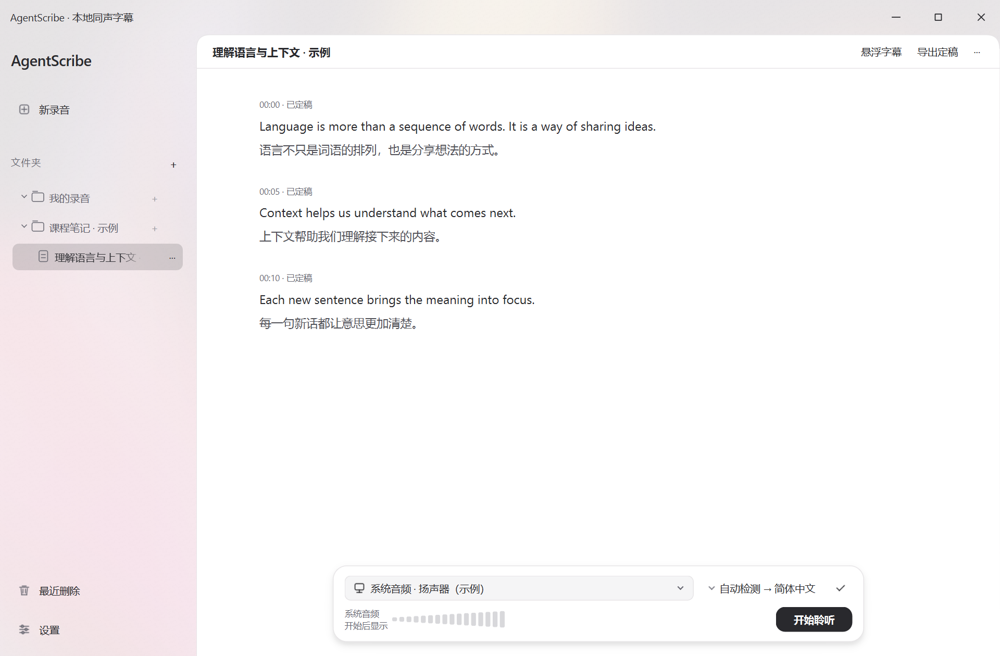

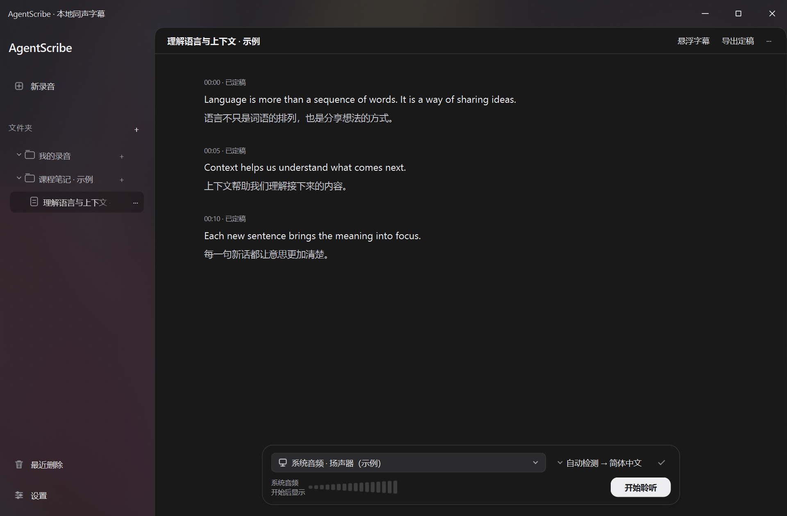

白色和深色只切换颜色。同一窗口尺寸下，侧栏宽度、小岛位置、控件高度、字号、间距和文本换行规则一致。不能为深色单独添加布局样式。尺寸与调色由 `ui_theme.py` 和共享组件决定。

| 角色 | 白色 | 深色 | 约束 |
| --- | --- | --- | --- |
| 阅读表面 | `#ffffff` | `#191919` | 正文清晰，不透出桌面内容 |
| 主要文字 | `#29292d` | `#ededf0` | 原文层级最高 |
| 次要文字 | `#666670` | `#aaaab2` | 时间、说明和状态较轻 |
| 控件底色 | `#f5f5f6` | `#2b2b2e` | 控件与正文通过边界区分 |
| 分隔边线 | `#e7e5e7` | `#353538` | 细线，不叠加厚边框 |
| 悬停覆盖色 | `#16141419` | `#24000000` | Qt ARGB；半透明加深原底色 |
| 选中覆盖色 | `#26141419` | `#40000000` | 比悬停更深，并保留文字可读性 |
| 工作区／小岛圆角 | 18 逻辑 px | 18 逻辑 px | 相邻表面的裁剪由外轮廓负责 |
| 常用控件圆角 | 9 逻辑 px | 9 逻辑 px | 特殊组件沿用共享组件尺寸 |

悬停遵循录音列表的覆盖色效果，保留背景原有色调，看起来稍暗。普通按钮不添加独立的 `QGraphicsDropShadowEffect`，避免穿模和多个 painter 冲突。主按钮保留实心底色并加深；选中项比悬停更明显。真正的投影用于小岛的固定层级：模糊 24、偏移 `(0, 4)`、黑色 alpha 30，并预留周边空间。


磨砂材质由 `ui_backdrop.py` 共用：当前模糊半径 112，壁纸贡献 0.08，高精度合成后输出每通道 8-bit，并加静态轻微抖动减少渐变色带。纹理按壁纸、尺寸和主题缓存；逐字显示时不重新模糊。没有壁纸时使用同一中性表面。该实现不承诺显示链路达到 10-bit，也不保证任何壁纸和屏幕下完全无色带。

顶栏与侧栏材质连续，正文、小岛和弹窗各自拥有完整外轮廓。子控件不得在共享边界重复画一套圆角，避免直角与圆角相接或接缝露底。

## 主界面、信息层级与操作路径

主路径为：新录音 → 必要时准备缺失模型 → 选择声音来源与语言 → 开始聆听 → 暂停／结束 → 回听／导出。录音库与设置放左侧；播放和采集使用同一小岛位置；模型下载、设备参数不占据字幕正文。

原文上方只显示时间与“优化中／已定稿”。翻译错误等必要反馈保留在相关内容附近，不在这里叠加多种识别阶段。追加原文按字符簇渐进显示，最长约 320 ms；修订立即替换，新追加内容不排队拖延。完整文本从开始显示时就参与布局，保存、翻译与定稿不等待动画。开启“减少动态效果”后直接显示。

没有录音时只保留“点击「新录音」开始。”，不再展示选择文件夹、首次创建标题或大段说明。

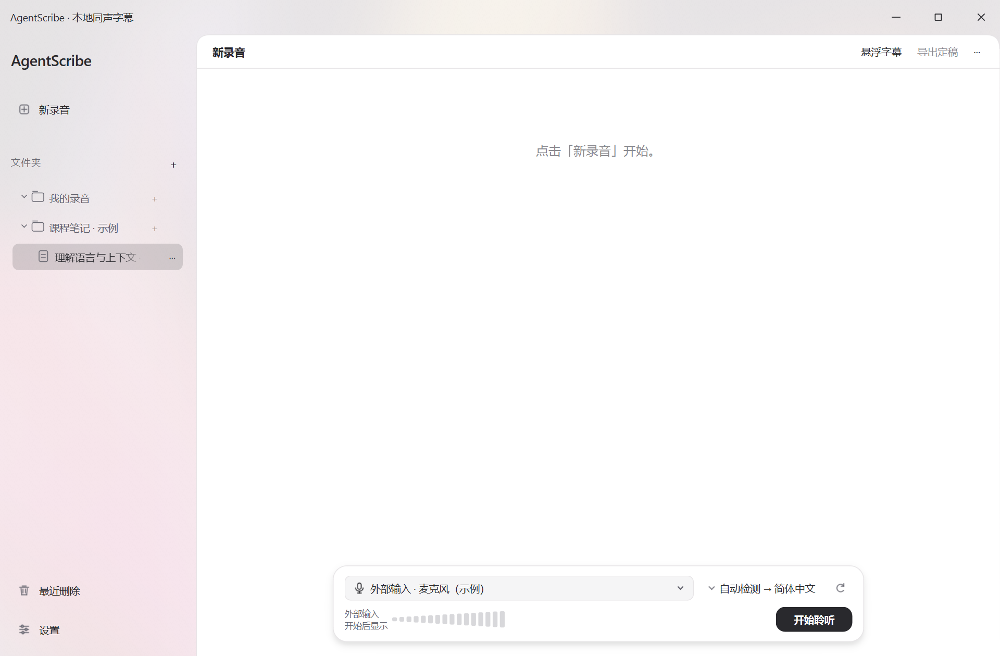

## 音频来源与录音／回放小岛

来源同时使用图标和文字分类：“系统音频”配显示器图标，“外部输入”配麦克风图标。具体设备名接在分类后。勾选表示当前选择，不依赖颜色区别。刷新应提供短暂完成反馈；设备失效应要求重新选择，不能自动跳到另一个来源。


| 状态 | 小岛呈现 | 行为约束 |
| --- | --- | --- |
| 尚未开始 | 声音源、语言、刷新、音量占位与开始聆听 | 明示“开始后显示”，不伪造实时输入 |
| 聆听中 | 声音源、语言、实时音量、暂停／结束 | 可请求切换来源；释放旧设备后接入新来源 |
| 暂停中 | 来源选择、暂停音量、继续／结束 | 选新来源不立即打开设备，继续时接入 |
| 切换／停止中 | 相关操作按会话状态禁用 | 防止重复启动；错误归属当前操作 |
| 可回听 | 播放／暂停图标、拖动进度、当前位置／总时长 | 隐藏开始聆听、来源、语言和刷新 |

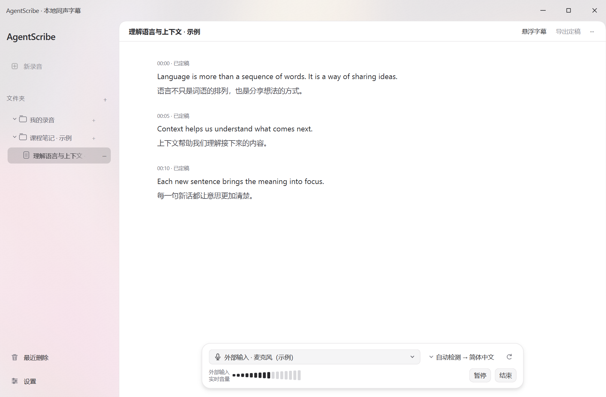

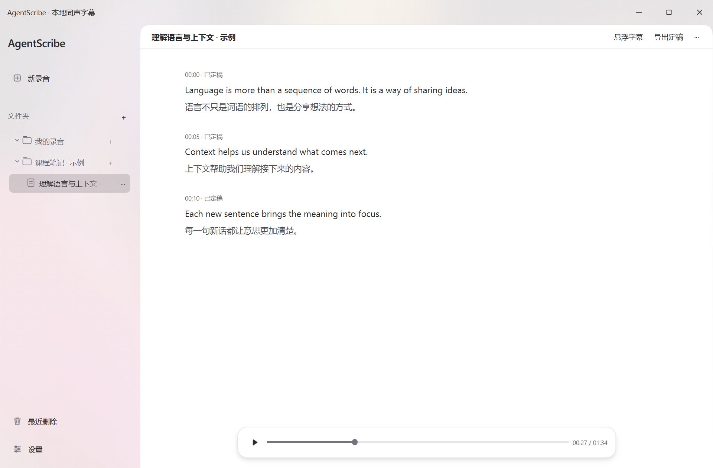

16 段音量条固定高 22，宽 72–144 逻辑 px，采用 RMS 对数显示与短动画。不能用全局状态文本代替音量，删除另一段录音的消息不应出现在当前来源下方。

小岛是字幕视口的覆盖组件，不给字幕铺一整条固定底栏。字幕可以从小岛下面通过，小岛外仍能看见；内容底部留出空间，让最后一段能滚到小岛上方。自动跟随取决于滚动位置，向上翻阅暂停跟随。

## 缩放与分屏

主窗口最小尺寸 640 × 480，初始 1280 × 840；不固定长宽比。录音侧栏宽度在 180–420 之间，可由分割器调整。设置侧栏按窗口宽度约 20% 分配，限制在 170–250；右侧表单在窄窗口换行，并用滚动区到达最后一项。

小岛宽度为 `min(680, 字幕视口宽度 - 48)`，居中，底部留 18 逻辑 px。小岛宽度小于 500 时，来源与语言从并排变为分行；不能压缩文字、图标或改字体来勉强塞入。长设备名可省略显示，但下拉与工具提示应保留完整名字。

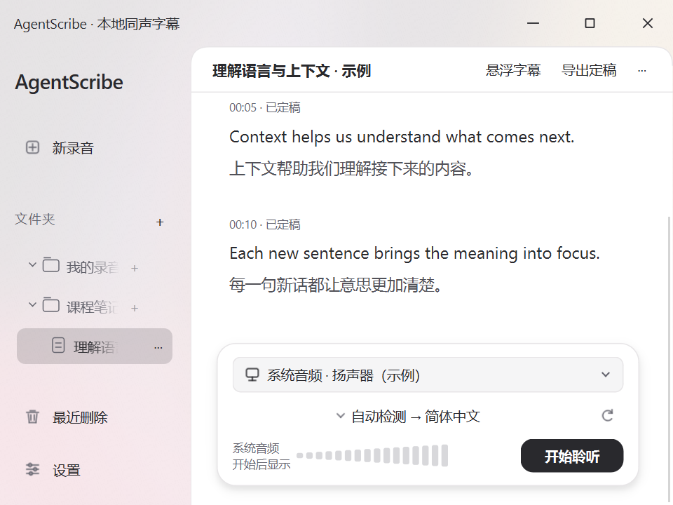

其余对照：[900 × 650](images/ui/workspace-900x650.png)、[700 × 960](images/ui/workspace-700x960.png)。这些均为实际布局，不是缩放主界面图片得到的结果。

Windows 的无边框窗口由 `window_platform.py` 接入系统缩放和 Snap；Mac 保留原生窗口框架与系统分屏行为。Mac 无需复制 Windows 的缩放按钮和边缘命中处理。手动缩放、最大化、分屏与显示器切换都应重新按逻辑尺寸布局；系统分屏效果需分别实机检查。

## 设置、模型选择与下载

设置统一使用常规、聆听、模型管理、字幕与延迟、运行环境、使用指南六个并列入口。保留搜索；不增加“显示更多设置”层级，也不展示已删除的键盘快捷键模块。录音保存位置直接显示真实路径；最近删除对应录音目录下的垃圾桶，兼容规则由文件库负责。

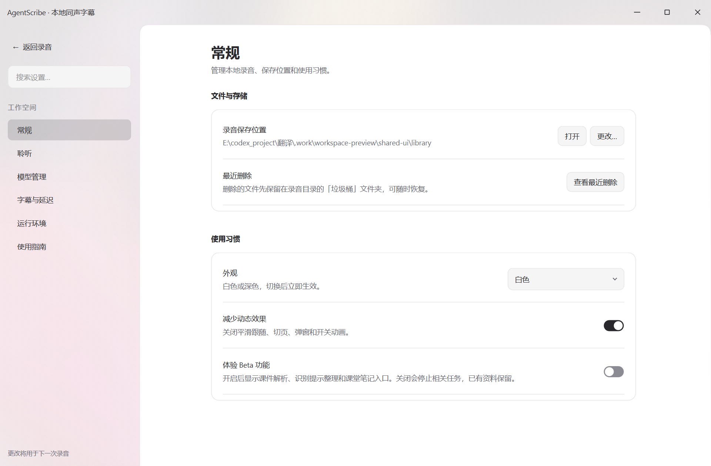

字幕与延迟的详细参数仍可在模块内展开，不能因此隐藏整个模块。参照 [字幕与延迟](images/ui/settings-captions.png) 和 [运行环境](images/ui/settings-runtime.png)，尤其检查窄窗口、展开参数后和滚动到底部的布局。

下载入口面向普通用户：列出少量明确版本与用途，默认不要求设置引擎、计算设备和刷新参数。Mac 推荐 Qwen3-ASR 1.7B MLX 4-bit + HY-MT2 1.8B Q4_K_M／llama.cpp；8-bit 标注待实机验收。Windows 当前提供 Qwen 原始 1.7B + 同一 HY Q4，不把 MLX 权重列为 Windows 可用模型。

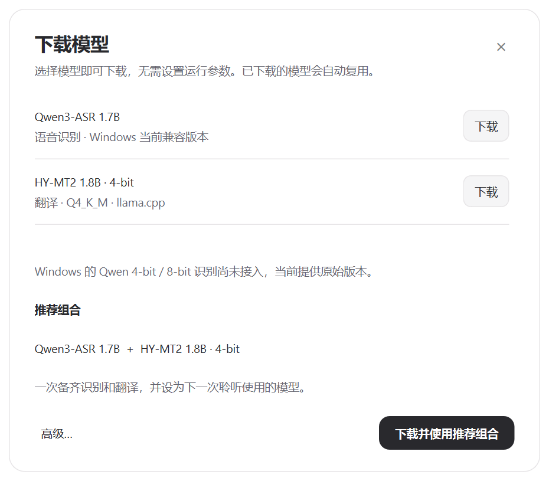

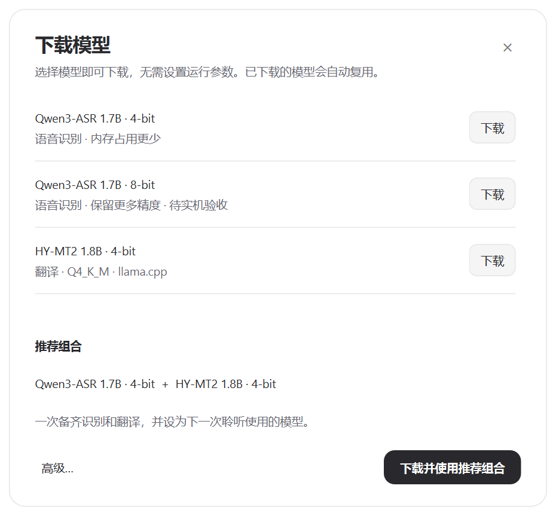

目录、版本标识和默认组合集中在 `model_options.py`。单独下载不改变当前模型；明确点击“下载并使用推荐组合”才保存下一次使用的两种模型，保持用户有效的设备选择。双击已下载模型打开同一个详情／设置窗口，高级区域收纳设备、参数、本地导入与自选地址。`hf://作者/仓库/文件.gguf` 是模型引用，不能在设置层当成本地文件路径改写。

新建或开始录音时缺少对应模型，才主动弹出可关闭的准备提示，提供便捷下载入口；关闭后仍可到模型管理下载。后台检查不自行弹窗或下载。已有会话使用独立快照，设置修改不能改变正在运行的模型。

下载状态在一张卡片维护：操作说明、文件名、完成量／总量／速度、细进度条与取消。未知总量显示忙碌进度，不显示假百分比；取消、失败、完成都有对应说明，不能把文件下载完成当成 GPU 推理验收。离开设置页不改变任务生命周期。

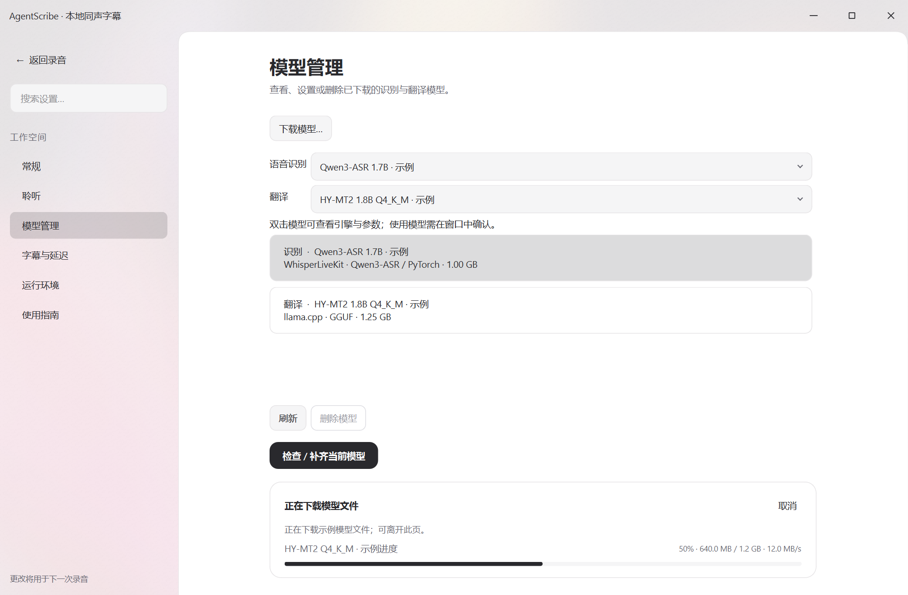

模型弹窗只接收设置快照并发出应用／下载信号；`ModelManager` 负责配置更新、准备任务与状态，弹窗不读取管理器的控件。这样 Mac 与 Windows 可以复用同一交互，平台仅决定目录内容与设备支持。

## 悬浮字幕

悬浮字幕使用独立、置顶的工具窗口。原文与译文使用相同字号和字重，通过颜色区分层级；字体回退不能使中文突然大一档。字号 12–56、背景不透明度 0–100% 使用滑块。背景透明度只改变底色，不降低文字和控件的透明度。

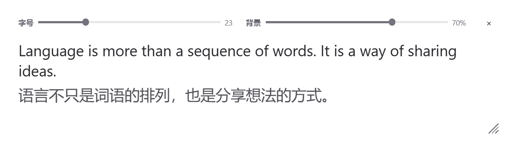

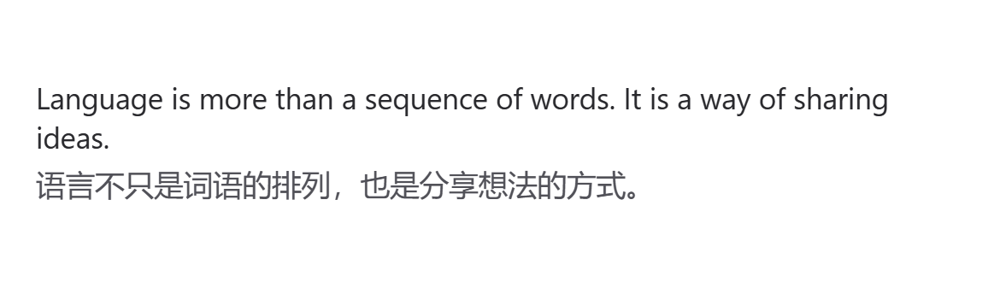

鼠标离开约 400 ms 后隐藏控制栏与缩放角标，但保留布局空间，字幕不跳动。空白头部可拖动窗口，不显示额外“拖拽移动”文字。改变字幕内容不能重置用户调整的尺寸、字号和位置。Mac 应实测窗口置顶、焦点切换、多显示器和系统全屏空间中的表现。

## Mac 适配与验收方法

| 保持一份的实现 | 允许的平台差异 |
| --- | --- |
| 主题、圆角、间距、悬停、选中、菜单、小岛与设置布局 | Windows 自绘标题栏；Mac 系统标题栏和应用菜单 |
| 字幕显示、字符动画、滚动、悬浮字幕设置 | 字体回退与系统显示缩放；按客户端逻辑尺寸比较 |
| 模型目录展示、配置快照、准备状态、取消与进度 | Windows PyTorch／CUDA；Mac MLX／Metal及对应模型格式 |
| 来源选择、切换请求、会话代次与音量显示 | WASAPI、CoreAudio、权限和 BlackHole 等输入接口 |
| 录音库、保存、恢复与导出 | 系统路径及文件管理器入口 |

源码同步与审核合入流程按 RELEASING 执行，不能只复制样式表或将图片当实现。共享模块包括 `ui_theme.py`、`ui_components.py`、`ui_backdrop.py`、`workspace_widgets.py`、`caption_view.py`、`subtitles_overlay.py`、`model_dialog.py`；平台窗口调用收敛在 `window_platform.py`，其导入不加载 Win32 DLL。

在允许访问窗口服务的 Mac 环境生成同一组示例：

```bash
.venv/bin/python scripts/preview_workspace.py --capture --output .work/browser/ui-design-mac
```

Windows 对应命令：

```powershell
.venv\Scripts\python.exe scripts\preview_workspace.py --capture --output .work/browser/ui-design-windows
```

脚本使用自己的示例库与偏好，关闭只影响自身预览。默认阻止模型准备、后台网络检查和音频访问；`.work/workspace-preview/shared-ui/render.json` 记录系统、Python、逻辑尺寸、像素比和图片清单。受限 Mac 环境可用 `QT_QPA_PLATFORM=offscreen` 验证布局，但不能代替 Cocoa、置顶或分屏检查。

验收时使用相同示例、主题、客户端尺寸和状态，检查：

1. 1280 × 840、900 × 650、640 × 480、700 × 960；白色与深色的相同尺寸下布局一致。Mac 原生标题栏占用不同，比较内容区域时扣除系统边框。
2. 长录音名、长路径、长设备名、中英混排、箭头、省略号、勾选和播放／暂停图标正常；不能出现方框或缺字。优先共用绘制图标，不依赖罕见 Unicode 字符。
3. 悬停仅加深底色；选中更明显；圆角接缝、弹窗、菜单和小岛投影没有裁剪或 painter 警告。
4. 设置参数展开后可滚到底；弹窗超出可用屏幕时可滚动；系统缩放和分屏后不重叠、不截断主要操作。
5. 录音、暂停、切换、停止、回听状态互斥；缺失模型提示可关闭；模型选择、下载与设备设置没有分叉入口。
6. 悬浮字幕控制栏隐藏后文字位置不变；透明度滑块不影响文字；置顶、移动、缩放与重新打开保留偏好。
7. 减少动态效果立即生效；连续追加、修订、快速切页和反复悬停不排队、不阻塞、不报 painter 警告。

上述图例与无音频测试验证布局及模拟交互。真实输入切换、保存回听、Mac 权限和 GPU 识别仍按项目实机验证要求单独验收；当前文档不宣称两端已经完全通过。
