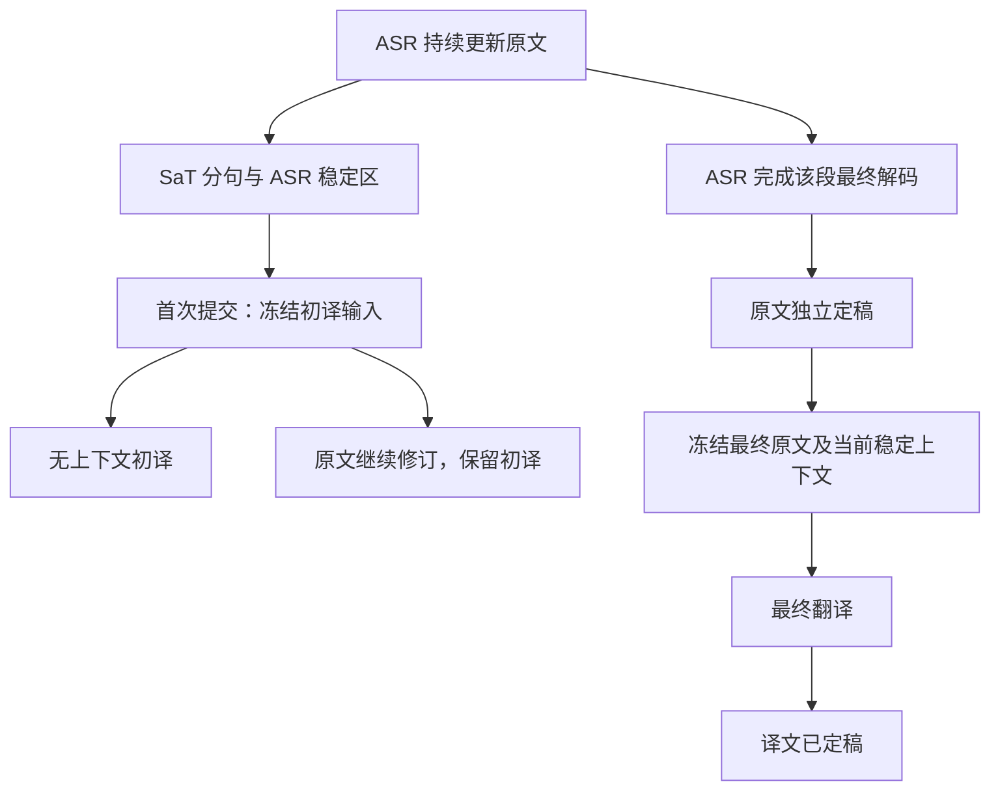

# 两阶段提交与翻译重构

2026-09-29，本地工作区验证；未发布新版本。

## 业务规则



- SaT 仍是必需依赖。分句和首次提交不等于原文定稿；翻译不能阻挡原文更新或定稿。
- 初译只处理第一次提交的原文，不带上下文。中间原文多次变化不产生翻译请求，界面明确显示旧初译的状态。
- 原文定稿后只再请求一次翻译；上下文冻结，不等新后文，也不因邻句随后修订而重译。NLLB 两阶段均不带上下文。
- 最终请求替换排队中的初译；初译已经算完且输入、语言、上下文完全相同时复用缓存。晚到初译不能覆盖最终结果。
- 每个正常字幕周期最多两个请求；源文本已经定稿后又被 ASR 明确纠正，会开启新的修订周期。失败不自动重试，保留已有初译并标记未完成。
- 首次提交后保持初译输入快照与段落身份；后续断句修复允许 SaT 撤回错误断点并合并，保留最早一条的初译，不再锁死错误布局。已提交片段内不重复新增暂定断点。
- 稳定尾部使用独立时钟触发首次提交（默认 3 秒、约 250 毫秒检查一次）。定稿必须收到 ASR 完成事件或 EOF；没有后续文字不再阻止收尾。完全断开且没有静音 PCM / EOF 的输入不视作识别完成。

## 三项参考及采用范围

| 参考 | 本项目采用的思路 |
| --- | --- |
| [Whisper-Streaming / LocalAgreement](https://github.com/ufal/whisper_streaming) | 利用识别稳定区支持提交；在本项目中不把短期一致等同于永久定稿 |
| [SimulStreaming](https://github.com/ufal/SimulStreaming) | ASR 与文本翻译级联、明确模块边界；本项目通过现有 WLK 完成事件驱动下游 |
| [Google Re-translation](https://research.google/pubs/re-translation-versus-streaming-for-simultaneous-translation/) | 允许修订译文，同时控制修订频率；按本次产品决定收敛为初译和最终翻译两次 |

这是结合现有后端和用户需求的业务策略，不是逐项复现论文算法。两次触发、默认 3 秒等待和段落身份规则不是论文证明的最优参数。Google 论文的逐 token 重译、masking / biasing 没有移植。

## 后续断句修复

发现原规则将每个识别段终点插成文本边界，并在首次提交后锁定该边界。现改为：SaT 判断句子，ASR 终点决定已完成的范围；句中停顿不强制拆句。逗号、冒号、分号、顿号后的候选断点不采用；近期不带句末标点的定稿可随后文重新合并，末尾空闲时仍可立即收尾翻译。

本次完整无音频回归 **207 passed、2 skipped**；修改文件 Ruff 通过。真实 SaT CPU 重放中英文四组跨停顿文本，均合为一句，包括 `The budget for this plan | is 9000.` 和 `如果这个条件成立，| 我们就可以使用这个公式。`。证据 `.work/cache/sentence-boundaries.json`，脚本 `.work/cache/check_sentence_boundaries.py`；这验证文本边界，不代表真实声学停顿已评测。错误分句原文样例和长课堂录音仍需进一步回放。

另外按下文相同环境重新运行 Qwen 1.7B 准确模式 + HY-MT2 的短文件测试，输出 `.work/cache/sentence-smoke.json`：三段完整字幕、停止前最终翻译全部到齐，PyTorch 显存峰值 7.20 GiB，音频守卫无访问记录。本次未重新实测 Whisper / 快速 Qwen / Mac；它们复用的字幕映射逻辑由模拟测试覆盖。全仓 Ruff 仍为 43 项历史问题。

## 自动测试

Windows AMD64 / Python 3.12.8：

```powershell
.venv\Scripts\python.exe scripts/test_no_audio.py -q
```

197 passed，2 skipped；未发现原生音频后端导入尝试。随后补充 UI 对“原文已定稿但仍只有初译”的保存检查，并对相关 UI、字幕映射、生命周期测试重新验证通过。覆盖：

- 项目 → 方案及预算 9000：中间修订不追加初译，最终源文决定最终翻译。
- 翻译阻塞期间原文照常定稿；最终请求、删除使迟到初译失效。
- 尾部时间到达只提交，ASR 关闭事件才定稿；后续新话语不被旧终点误定稿。
- 词时间戳只定位整段终点，不能把一句话拆成逐词字幕。
- 冻结上下文、相同请求复用缓存、空译文失败、旧录音兼容、初译导出标记。

本次修改文件 Ruff 通过。全仓 Ruff 仍有 43 项历史问题，主要在评测脚本和旧测试；未扩大范围统一修复。`git diff --check` 通过。

## 真实文件推理

环境：Windows AMD64，Python 3.12.8，RTX 5070 Ti，PyTorch 2.11.0+cu128，Transformers 4.57.6；SaT 使用 CPU，识别和 HY-MT2 使用 CUDA。仅送入已有 `tests/fixtures/hello.wav`，没有声卡采集、播放或设备枚举，守卫日志未出现后端访问尝试。

每次按实时节奏输入 5.624 秒文件及 1 秒静音，然后不再输入 PCM，保持会话 10 秒后才发送停止。脚本断言：**停止前的字幕集合已完整、源文全部定稿、全部拥有最终译文且无错误**。

```powershell
# 在启用 scripts/test_no_audio.py 的 GUARD 的子进程环境中执行；本次使用已有
# .work/cache/vad-dtype/sitecustomize.py，并设置 HF_HUB_OFFLINE / TRANSFORMERS_OFFLINE=1。
.venv\Scripts\python.exe scripts/smoke_wlk.py --backend qwen3-streaming --qwen-model Qwen/Qwen3-ASR-1.7B --translate --translation-model tencent/Hy-MT2-1.8B --hold-open 10 --output .work/cache/two-phase/fast.json
.venv\Scripts\python.exe scripts/smoke_wlk.py --backend qwen3-streaming --qwen-mode accurate --qwen-model Qwen/Qwen3-ASR-1.7B --translate --translation-model tencent/Hy-MT2-1.8B --hold-open 10 --output .work/cache/two-phase/accurate-final.json
.venv\Scripts\python.exe scripts/smoke_wlk.py --backend wlk-whisper --model large-v3 --translate --translation-model tencent/Hy-MT2-1.8B --hold-open 10 --output .work/cache/two-phase/whisper-final.json
```

| 后端 | 最终字幕 | 停止前完成翻译 | PyTorch 显存峰值 |
| --- | --- | --- | --- |
| Qwen 1.7B 快速模式 | 3 段，参考文本词序完整 | 通过 | 7.23 GiB |
| Qwen 1.7B 准确模式 | 3 段，参考文本词序完整 | 通过 | 7.19 GiB |
| Whisper large-v3 | 3 段，参考文本词序完整；Hello 带问号 | 通过 | 6.72 GiB |

最后一句：`Today we are discussing a new project.`，最终译文：`今天我们将讨论一个新项目。`（准确模式含逗号）。原始事件、日志、配置和文本在 `.work/cache/two-phase/`，以前缀 `fast`、`accurate-final`、`whisper-final` 为准。较早的 `accurate`、`whisper` 输出暴露逐词分句问题，已修复并重新运行，不能作为最终验收结果。

短音频中识别段很快结束，模型调用直接进入最终翻译；中间多次修订后仅初译一次的行为由控制时钟及阻塞翻译器测试验证。此次文件测试不代表已完成真实课堂质量或长会话性能评测。

## 界面及待验证范围

真实 Qt 窗口使用隔离示例库、`Window(discover=False)` 和音频导入守卫。检查初译来源变化与最终状态，900×650 / 1280×840 等窗口截图在 `.work/ui-experience/`；初译状态文字可读，无裁切。

本轮未操作真实麦克风/系统音频、录音回听或用户正在运行的会话。macOS / MLX 实机没有复测，共用适配层变化仅有模拟覆盖；历史 Mac 测试不能替代本次验收。中文、长课堂停顿、段落布局和翻译质量仍需代表性录音评测。
